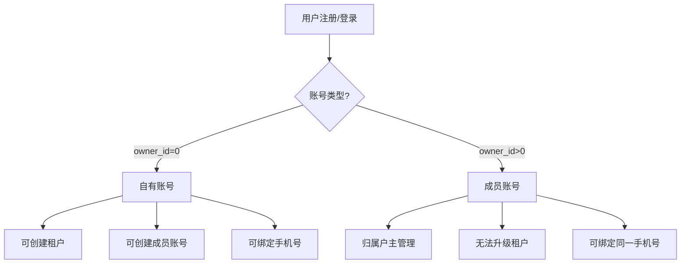
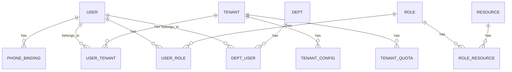
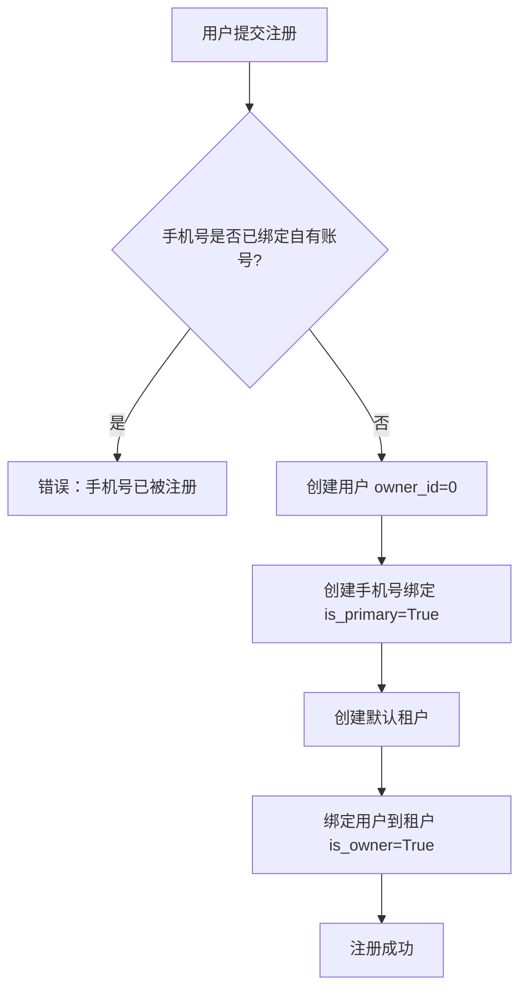
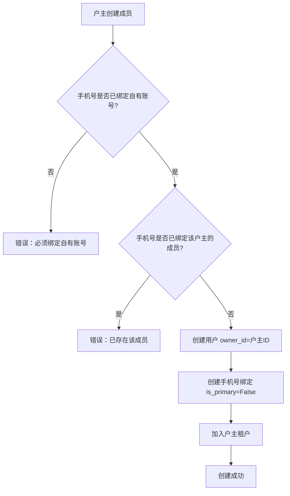
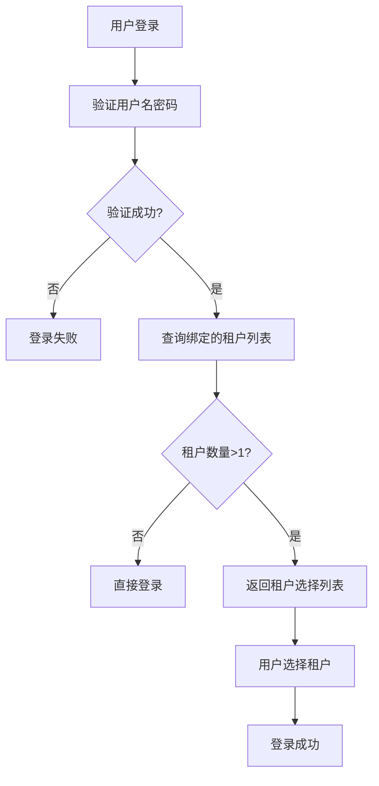
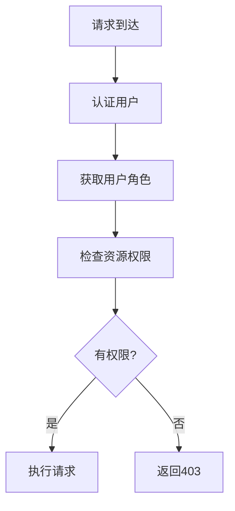
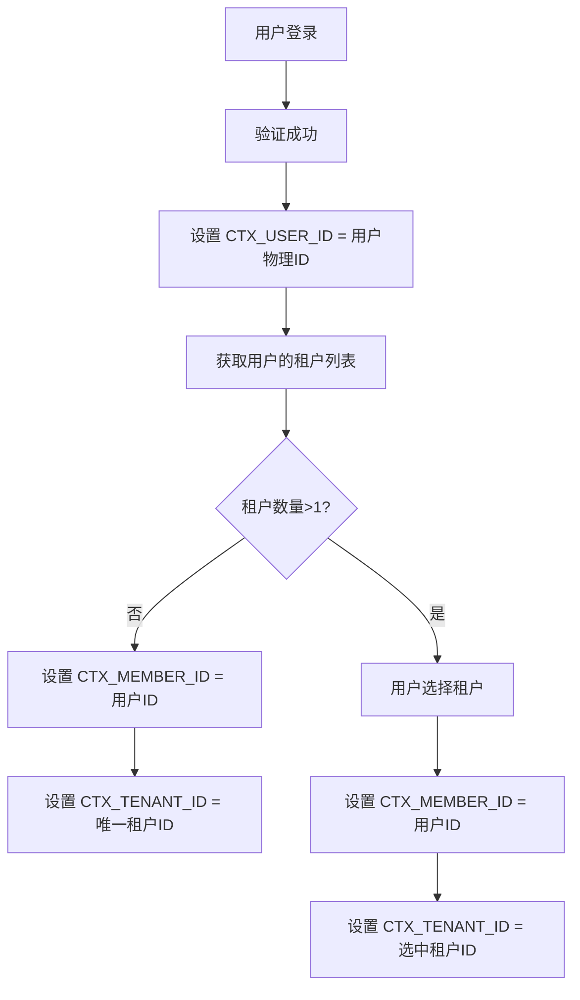
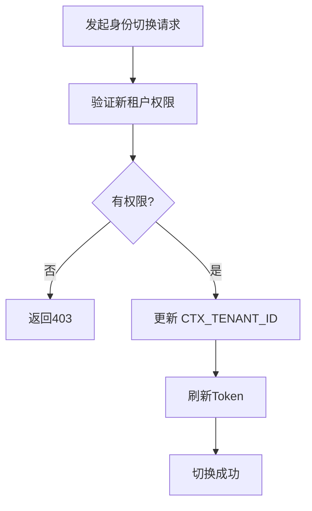
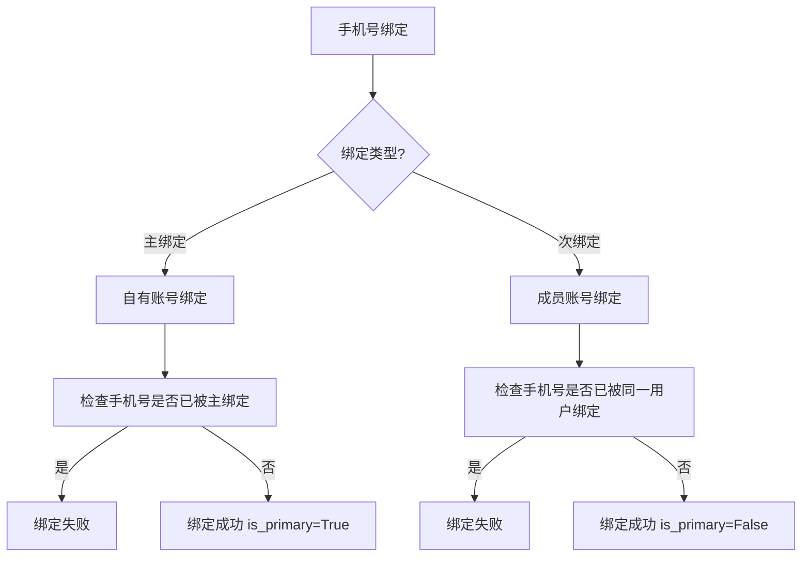
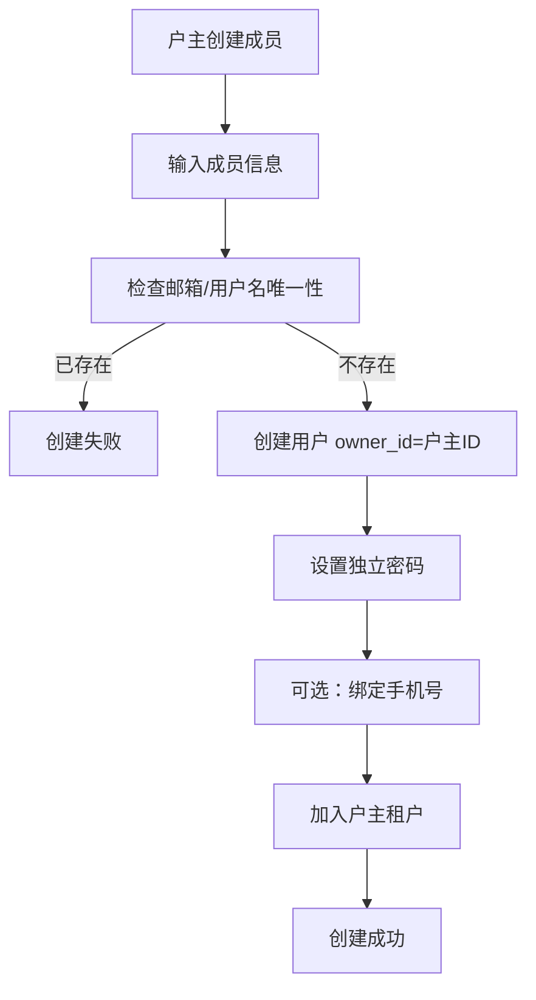

# 身份权限体系重构方案

## 一、需求分析

### 1.1 业务需求概述

| 需求点 | 描述 | 优先级 |
|-------|------|-------|
| 账号类型区分 | 通过 owner_id 判断：0=自有账号，非0=成员账号 | 高 |
| 户主管理成员 | 户主可创建/管理成员账号 | 高 |
| 手机号绑定 | 1个手机号 ↔ 1个自有账号 ↔ N个成员账号 | 高 |
| 身份切换登录 | 支持多身份登录切换 | 中 |
| 租户隔离 | 成员账号归属于户主，无法升级租户 | 高 |
| 权限体系 | RBAC角色权限管理 | 高 |

### 1.2 核心业务规则



---

## 二、现有设计分析

### 2.1 优点

| 维度 | 评价 | 说明 |
|-----|------|------|
| 模块划分 | ✅ 良好 | 按领域划分：iam/、tenant/、system/ |
| Mixin设计 | ✅ 良好 | TenantMixin、SystemBuiltinMixin 等设计合理 |
| 关联表处理 | ✅ 良好 | 建议关联表为纯Table对象，不导出 |

### 2.2 待完善点

| 维度 | 问题 | 影响 |
|-----|------|------|
| 账号类型 | ❌ 缺失 | owner_id字段未在设计中体现 |
| 手机号绑定 | ❌ 缺失 | phone_binding表设计不完整 |
| 租户成员关系 | ❌ 缺失 | user_tenant关联表需补充扩展字段 |
| 多身份登录 | ❌ 缺失 | 无相关设计 |

---

## 三、重构方案

### 3.1 模型结构设计

```
src/models/
├── __init__.py               # 全局导出：仅业务模型，无关联表
├── core/                     # 模型核心基础层
│   ├── __init__.py
│   └── base.py               # BaseModel + Mixins
│
├── iam/                      # 身份权限体系
│   ├── __init__.py
│   ├── user.py               # 用户模型（含owner_id字段）
│   ├── phone_binding.py      # 手机号绑定表
│   ├── dept.py               # 部门 + 部门闭包表
│   ├── role.py               # 角色
│   ├── resource.py           # 资源/菜单/接口权限
│   └── associations.py       # 权限多对多关联表（纯Table，不导出）
│
├── tenant/                   # 多租户核心
│   ├── __init__.py
│   ├── tenant.py             # 租户/企业信息
│   ├── tenant_config.py      # 租户自定义配置
│   ├── tenant_quota.py       # 租户配额
│   └── user_tenant.py        # 用户-租户关联（含is_owner/joined_at）
│
└── system/                   # 系统基础模块
    ├── __init__.py
    ├── dict.py               # 系统字典
    ├── config.py             # 系统全局配置
    ├── log.py                # 操作日志 + 登录日志
    └── file.py               # 文件映射表
```

### 3.2 核心模型字段设计

#### 3.2.1 User 模型（src/models/iam/user.py）

| 字段名 | 类型 | 约束 | 说明 |
|-------|------|------|------|
| id | Integer | PK | 用户ID |
| username | String(50) | Unique, NotNull | 用户名 |
| email | String(100) | Unique, NotNull | 邮箱 |
| password | String(255) | NotNull | 密码哈希 |
| owner_id | Integer | FK(User.id), default=0 | 户主ID（0=自有账号） |
| nickname | String(50) | - | 昵称 |
| avatar | String(255) | - | 头像URL |
| is_active | Boolean | default=True | 是否启用 |
| is_system | Boolean | default=False | 是否系统内置 |
| created_at | DateTime | auto_now_add | 创建时间 |
| updated_at | DateTime | auto_now | 更新时间 |
| remark | String(500) | - | 备注 |

#### 3.2.2 PhoneBinding 模型（src/models/iam/phone_binding.py）

| 字段名 | 类型 | 约束 | 说明 |
|-------|------|------|------|
| id | Integer | PK | ID |
| phone | String(20) | Unique, NotNull | 手机号码 |
| user_id | Integer | FK(User.id), NotNull | 用户ID |
| is_primary | Boolean | default=True | 是否主绑定（自有账号） |
| verified_at | DateTime | - | 验证时间 |
| created_at | DateTime | auto_now_add | 创建时间 |

#### 3.2.3 UserTenant 模型（src/models/tenant/user_tenant.py）

| 字段名 | 类型 | 约束 | 说明 |
|-------|------|------|------|
| id | Integer | PK | ID |
| user_id | Integer | FK(User.id), NotNull | 用户ID |
| tenant_id | Integer | FK(Tenant.id), NotNull | 租户ID |
| is_owner | Boolean | default=False | 是否户主 |
| role | String(50) | default='member' | 租户内角色 |
| joined_at | DateTime | auto_now_add | 加入时间 |
| status | Integer | default=1 | 状态（1=启用，0=禁用） |

### 3.3 Mixin 标准化设计

#### 3.3.1 BaseModel 基础扩展

| 方法名 | 功能 | 参数 | 返回值 |
|-------|------|------|------|
| to_dict() | 模型转字典 | exclude_fields: list | dict |
| save() | 保存/更新 | - | None |
| delete(soft=True) | 删除（默认软删） | soft: bool | None |

#### 3.3.2 TenantMixin

| 方法名 | 功能 | 参数 | 返回值 |
|-------|------|------|------|
| filter_by_tenant() | 按租户过滤查询 | tenant_id: int | Query |

#### 3.3.3 SystemBuiltinMixin

| 方法名 | 功能 | 参数 | 返回值 |
|-------|------|------|------|
| is_deletable() | 判断是否可删除 | - | bool |
| is_editable() | 判断是否可编辑 | - | bool |

### 3.4 关联关系设计



---

## 四、业务流程设计

### 4.1 注册流程



### 4.2 户主创建成员流程



### 4.3 登录流程（支持多身份切换）



---

## 五、权限体系设计

### 5.1 角色分层

| 层级 | 角色类型 | 说明 |
|-----|---------|------|
| 平台级 | 平台超级管理员 | 管理整个平台 |
| 平台级 | 平台运营管理员 | 运营相关权限 |
| 租户级 | 租户管理员 | 管理单个租户 |
| 租户级 | 租户成员 | 普通成员权限 |
| 成员级 | 成员账号 | 受限权限 |

### 5.2 权限检查流程



---

## 六、API 接口规划

### 6.1 用户认证接口

| 接口 | 方法 | 路径 | 说明 |
|-----|------|------|------|
| 注册 | POST | /api/v1/auth/register | 用户注册 |
| 登录 | POST | /api/v1/auth/login | 用户登录 |
| 多身份登录 | POST | /api/v1/auth/login-with-tenant | 指定租户登录 |
| 获取租户列表 | GET | /api/v1/auth/tenants | 获取当前用户的租户列表 |
| 身份切换 | POST | /api/v1/auth/switch-tenant | 切换当前租户 |
| 退出登录 | POST | /api/v1/auth/logout | 退出登录 |

### 6.2 用户管理接口

| 接口 | 方法 | 路径 | 说明 |
|-----|------|------|------|
| 获取用户列表 | GET | /api/v1/admin/users | 管理员获取用户列表 |
| 获取用户详情 | GET | /api/v1/users/{user_id} | 获取用户详情 |
| 创建用户 | POST | /api/v1/admin/users | 管理员创建用户 |
| 更新用户 | PUT | /api/v1/users/{user_id} | 更新用户信息 |
| 删除用户 | DELETE | /api/v1/admin/users/{user_id} | 管理员删除用户 |
| 创建成员 | POST | /api/v1/me/members | 户主创建成员账号 |
| 获取成员列表 | GET | /api/v1/me/members | 获取我的成员列表 |
| 删除成员 | DELETE | /api/v1/me/members/{user_id} | 删除成员 |

### 6.3 手机号绑定接口

| 接口 | 方法 | 路径 | 说明 |
|-----|------|------|------|
| 获取绑定列表 | GET | /api/v1/users/phone-bindings | 获取手机号绑定列表 |
| 绑定手机号 | POST | /api/v1/users/phone-bindings | 绑定手机号 |
| 解绑手机号 | DELETE | /api/v1/users/phone-bindings/{id} | 解绑手机号 |

---

## 七、数据库迁移规划

### 7.1 新增字段

| 表名 | 字段名 | 类型 | 说明 |
|-----|-------|------|------|
| user | owner_id | INTEGER | 户主ID |
| user_tenant | is_owner | BOOLEAN | 是否户主 |
| user_tenant | role | VARCHAR(50) | 租户内角色 |
| user_tenant | joined_at | DATETIME | 加入时间 |

### 7.2 新增表

| 表名 | 说明 |
|-----|------|
| phone_binding | 手机号绑定表 |

---

## 八、代码安全性

### 8.1 注意事项

| 风险点 | 风险等级 | 说明 |
|-------|---------|------|
| 成员账号越权 | 高 | 成员账号可能尝试访问户主权限 |
| 租户隔离 | 高 | 确保数据按租户隔离 |
| 密码安全 | 高 | 密码哈希存储，禁止明文 |
| SQL注入 | 高 | 使用ORM，禁止拼接SQL |
| Token安全 | 中 | Token过期处理，刷新机制 |
| 手机号泄露 | 中 | 脱敏处理，日志不记录完整手机号 |

### 8.2 解决方案

| 风险点 | 解决方案 |
|-------|---------|
| 成员账号越权 | 权限检查时验证owner_id |
| 租户隔离 | TenantMixin自动过滤 |
| 密码安全 | 使用argon2或bcrypt |
| SQL注入 | 使用SQLAlchemy ORM |
| Token安全 | 使用Redis存储，设置过期时间 |
| 手机号泄露 | 日志中手机号脱敏（如138****8888） |

---

## 九、实施建议

### 9.1 阶段划分

| 阶段 | 任务 | 周期 |
|-----|------|------|
| 第一阶段 | 模型层重构 | 1-2周 |
| 第二阶段 | Repository层适配 | 1周 |
| 第三阶段 | Service层业务逻辑 | 2周 |
| 第四阶段 | API层接口实现 | 1-2周 |
| 第五阶段 | 测试与上线 | 1周 |

### 9.2 关键里程碑

| 里程碑 | 描述 |
|-----|------|
| 模型层完成 | 所有模型设计并迁移完成 |
| 核心业务完成 | 注册、登录、成员管理功能完成 |
| 权限体系完成 | RBAC权限检查完成 |
| 测试通过 | 单元测试、集成测试通过 |

---

## 十、已确认的业务规则

根据您的反馈，以下规则已确认：

| 规则项 | 确认方案 |
|-------|---------|
| 成员账号密码 | 独立密码（每个成员账号有独立密码） |
| 身份切换验证 | 无需验证（登录后可自由切换身份） |
| 租户配额计算 | 按户主账号计算 |
| 成员手机号绑定 | 允许绑定不同手机号 |

---

## 十一、上下文管理设计

### 11.1 上下文变量定义（src/core/ctx.py）

根据您的要求，用户物理ID对用户无感知，业务逻辑通过成员ID和租户ID实现：

| 上下文变量 | 类型 | 说明 |
|-----------|------|------|
| CTX_USER_ID | int | 用户物理ID（内部使用） |
| CTX_MEMBER_ID | int | 成员ID（当前登录身份） |
| CTX_TENANT_ID | int | 租户ID（当前租户上下文） |

### 11.2 上下文设置时机



### 11.3 上下文使用示例

```python
# 获取上下文
from src.core.ctx import get_current_user_id, get_current_member_id, get_current_tenant_id

# 在Service层使用
def get_user_profile():
    user_id = get_current_user_id()      # 用户物理ID（内部使用）
    member_id = get_current_member_id()  # 成员ID（业务使用）
    tenant_id = get_current_tenant_id()  # 租户ID（业务使用）
    
    # 业务逻辑...
```

### 11.4 身份切换流程



---

## 十二、补充说明

### 12.1 用户物理ID vs 成员ID

| 概念 | 说明 | 使用场景 |
|-----|------|---------|
| 用户物理ID | 用户表的主键ID | 内部数据关联、审计日志 |
| 成员ID | 当前登录身份的ID | 业务逻辑、权限判断 |

### 12.2 手机号绑定规则更新



### 12.3 成员账号创建流程更新


